Managing database credentials is one of the persistent challenges in cloud infrastructure. Passwords need to be rotated, secrets need to be stored securely, and access needs to be carefully controlled. AWS IAM authentication for RDS offers a better way: instead of managing long-lived passwords, your applications authenticate using short-lived tokens generated from IAM credentials. This approach is more secure, eliminates password rotation overhead, and integrates seamlessly with your existing IAM policies. With Pulumi, you can set up this entire system using reusable components that make IAM authentication a standard part of your infrastructure.

<!--more-->

## Why IAM authentication for PostgreSQL?

Traditional database authentication relies on usernames and passwords. These credentials need to be stored somewhere secure, rotated regularly, and distributed to applications that need them. Each of these steps introduces complexity and potential security risks.

IAM authentication changes this model fundamentally. Instead of passwords, your applications generate authentication tokens on demand using their IAM credentials. These tokens are valid for only 15 minutes, eliminating the need for password rotation. Access control happens through IAM policies, which you're already using to manage other AWS resources. The result is a more secure system that's easier to maintain and audit.

The benefits become even more pronounced when you componentize this setup with Pulumi. Rather than repeating the same configuration steps for each database, you can build reusable components that handle IAM authentication setup automatically. This turns a complex, multi-step process into a simple, repeatable pattern that your entire team can use. In this post, we'll cover an example that sets up the complete flow: an RDS cluster with IAM authentication, the necessary IAM roles and policies, and a Kubernetes application that connects using IAM tokens.

## Architecture overview

This example sets up a complete environment with IAM-authenticated database access from a Kubernetes application. The architecture includes:

- VPC with public and private subnets across multiple availability zones
- EKS cluster for running containerized applications
- Aurora PostgreSQL cluster with IAM authentication enabled
- IAM roles and policies that connect Kubernetes service accounts to database access
- A demo application that authenticates to the database using IAM tokens


The key integration point is IAM Roles for Service Accounts (IRSA), which allows Kubernetes pods to assume IAM roles. This means your application doesn't need any AWS credentials stored in environment variables or mounted secrets. The pod's service account automatically has the permissions it needs to generate database authentication tokens.

## Setting up the RDS cluster with IAM authentication

The foundation of this setup is an RDS cluster configured to accept IAM authentication. With Pulumi's componentized approach, you can encapsulate all the RDS configuration in a reusable component:

```typescript
const rdsCluster = new RdsCluster("iam-postgres", {
  vpcId: vpc.vpc.id,
  vpcCidrBlock: vpc.vpc.cidrBlock,
  subnetIds: vpc.publicSubnets.map((s) => s.id),
  databaseName: DATABASE_NAME,
  masterUsername: MASTER_USERNAME,
  masterPassword: dbMasterPassword,
  instanceClass: "db.t4g.medium",
  engineVersion: "17.4",
  iamDatabaseUser: IAM_DB_USERNAME,
});
```

Inside the component, the critical configuration is `iamDatabaseAuthenticationEnabled`:

```typescript
this.cluster = new aws.rds.Cluster(
  `${name}-cluster`,
  {
    engine: "aurora-postgresql",
    engineVersion: engineVersion,
    databaseName: args.databaseName,
    masterUsername: args.masterUsername,
    masterPassword: args.masterPassword,
    dbSubnetGroupName: subnetGroup.name,
    vpcSecurityGroupIds: [this.securityGroup.id],
    iamDatabaseAuthenticationEnabled: true,
    skipFinalSnapshot: true,
    tags: { Name: `${name}-cluster` },
  },
  { parent: this }
);
```

This single flag tells RDS to accept authentication tokens in addition to traditional passwords. The cluster still needs a master password for initial setup and administrative tasks, but your applications can use IAM authentication instead.

## Creating the database user with IAM permissions

Enabling IAM authentication on the cluster isn't enough. You also need to create a database user and grant it the special `rds_iam` role that allows IAM authentication. This is where Pulumi's PostgreSQL provider comes in:

```typescript
const dbSetup = new DbSetup(
  "iam-postgres",
  {
    dbEndpoint: rdsCluster.cluster.endpoint,
    dbName: DATABASE_NAME,
    masterUsername: MASTER_USERNAME,
    masterPassword: dbMasterPassword,
    iamUsername: IAM_DB_USERNAME,
  },
  { dependsOn: [rdsCluster.instance] }
);
```

The `DbSetup` component handles all the database-level configuration. It creates the IAM user and grants the necessary permissions:

```typescript
// Create IAM-enabled database user
this.iamRole = new postgresql.Role(
  `${name}-iam-user`,
  {
    name: args.iamUsername,
    login: true,
  },
  { parent: this, provider: this.provider }
);

// Grant rds_iam role to enable IAM authentication
new postgresql.GrantRole(
  `${name}-grant-rds-iam`,
  {
    role: this.iamRole.name,
    grantRole: "rds_iam",
  },
  { parent: this, provider: this.provider }
);
```

The component also grants the necessary database privileges (CONNECT, USAGE, CREATE, and table operations). By encapsulating this in a component, you ensure that every IAM-authenticated database user is set up consistently with the correct permissions.

## Configuring IAM policies for database access

The next piece is the IAM role and policy that allows applications to generate authentication tokens. This involves two parts: the role that the application assumes, and the policy that grants database access.

For Kubernetes applications, this uses IRSA (IAM Roles for Service Accounts). The `RdsCluster` component includes a method that creates the appropriate IAM role:

```typescript
const rdsIamRole = rdsCluster.createIamRole(
  eksCluster.oidcProvider,
  NAMESPACE,
  SERVICE_ACCOUNT_NAME
);
```

This creates an IAM role with a trust policy that allows the specified Kubernetes service account to assume it:

```typescript
assumeRolePolicy: pulumi
  .all([oidcProvider.arn, oidcProvider.url])
  .apply(([arn, url]) =>
    JSON.stringify({
      Version: "2012-10-17",
      Statement: [
        {
          Effect: "Allow",
          Principal: { Federated: arn },
          Action: "sts:AssumeRoleWithWebIdentity",
          Condition: {
            StringEquals: {
              [`${url}:sub`]: `system:serviceaccount:${namespace}:${serviceAccountName}`,
            },
          },
        },
      ],
    })
  ),
```

The role is then granted the `rds-db:connect` permission for the specific database user:

```typescript
{
  Version: "2012-10-17",
  Statement: [
    {
      Effect: "Allow",
      Action: ["rds-db:connect"],
      Resource: `arn:aws:rds-db:${region}:${accountId}:dbuser:${resourceId}/${iamDatabaseUser}`,
    },
  ],
}
```

This policy is scoped to exactly one database user on one cluster. This level of granularity is one of the security advantages of IAM authentication: you can control database access with the same precision you use for other AWS resources.

## Connecting from Kubernetes with IRSA

The application running in Kubernetes needs a service account annotated with the IAM role ARN:

```typescript
this.serviceAccount = new k8s.core.v1.ServiceAccount(
  `${name}-sa`,
  {
    metadata: {
      name: args.serviceAccountName,
      namespace: args.namespace,
      annotations: {
        "eks.amazonaws.com/role-arn": args.iamRoleArn,
      },
    },
  },
  { parent: this, provider: args.provider }
);
```

When a pod uses this service account, EKS automatically configures the pod with temporary AWS credentials for the associated IAM role. The application can then use these credentials to generate database authentication tokens.

## How IAM authentication works at runtime

The authentication flow happens at connection time:

```mermaid
%%{init: {'theme':'base', 'themeVariables': { 'primaryColor':'#FF9900','primaryTextColor':'#232F3E','primaryBorderColor':'#232F3E','lineColor':'#666','secondaryColor':'#527FFF','tertiaryColor':'#fff'}}}%%
sequenceDiagram
    autonumber
    participant App as Application Pod
    participant SDK as AWS SDK
    participant STS as AWS STS
    participant IAM as AWS IAM
    participant RDS as RDS Aurora

    rect rgb(255, 249, 230)
        Note over App,SDK: Phase 1: Token Generation
        activate App
        App->>+SDK: generate_db_auth_token()
        SDK->>+STS: Get temporary credentials (IRSA)
        STS-->>-SDK: Return AWS credentials
        SDK->>SDK: Sign auth request
        SDK-->>-App: Return IAM token (15 min TTL)
        deactivate App
    end

    rect rgb(235, 245, 255)
        Note over App,RDS: Phase 2: Database Connection
        activate App
        App->>+RDS: Connect (user + IAM token)
        activate RDS
        RDS->>+IAM: Validate token & permissions
        IAM-->>-RDS: Token valid + rds-db:connect allowed
        RDS->>RDS: Verify rds_iam role
        RDS-->>-App: Connection established
        deactivate App
    end

    Note over App,RDS: 💡 Token expires after 15 minutes - generate new token per connection
```



1. The application uses the AWS SDK to call `generate_db_auth_token()`, passing the database endpoint, port, and username
1. The SDK uses the pod's IAM credentials (provided automatically by IRSA) to sign the request and generate a token
1. The application connects to PostgreSQL using the IAM username and the token as the password
1. RDS validates the token against IAM, verifying that the caller has `rds-db:connect` permission for that database user
1. If the token is valid, the connection is established

Here's what this looks like in Python:

```python
def get_iam_token():
    """Generate an IAM authentication token for RDS"""
    client = boto3.client('rds', region_name=AWS_REGION)
    token = client.generate_db_auth_token(
        DBHostname=DB_ENDPOINT,
        Port=DB_PORT,
        DBUsername=DB_USER,
        Region=AWS_REGION
    )
    return token

def get_db_connection():
    """Create a database connection with IAM auth"""
    token = get_iam_token()
    return psycopg2.connect(
        host=DB_ENDPOINT,
        port=DB_PORT,
        database=DB_NAME,
        user=DB_USER,
        password=token,
        sslmode='require',
        sslrootcert=RDS_CA_CERT
    )
```

The token is valid for 15 minutes. Applications should generate a new token for each connection or implement token caching with refresh logic.

## Testing the setup with the demo application

The example includes an interactive demo application that lets you test the IAM authentication setup. Once deployed, the application provides a web interface for creating tables, adding messages, and querying the database:


Deploy the infrastructure and access the demo app:

```bash
pulumi up
export APP_URL=$(pulumi stack output appUrl)
echo "Demo app: http://$APP_URL"
```

The application shows the database endpoint and IAM username it's using, and provides buttons to create tables and add data. Behind the scenes, every database operation authenticates using IAM tokens, demonstrating that the entire authentication flow is working correctly.

{}
The full code for this example is available at [https://github.com/pulumi-demos/examples/tree/main/typescript/aws-iam-for-postgres](https://github.com/pulumi-demos/examples/tree/main/typescript/aws-iam-for-postgres). The example includes all the component code referenced in this post.
{}

## Production considerations

This example demonstrates IAM authentication in a working environment, but you'll want to make several adjustments for production use:

**Network security**: The example places RDS in public subnets to allow the PostgreSQL provider to connect during deployment. In production, place RDS in private subnets and ensure your deployment environment (like GitHub Actions or Pulumi Cloud) can reach the database for initial setup, either through a bastion host or VPN.

**Connection pooling and performance**: IAM tokens expire after 15 minutes. If you're using connection pooling, you'll need logic to refresh tokens before they expire. AWS recommends using IAM authentication only when your application creates [fewer than 200 new connections per second](https://docs.aws.amazon.com/AmazonRDS/latest/AuroraUserGuide/UsingWithRDS.IAMDBAuth.html#UsingWithRDS.IAMDBAuth.ConnectionsPerSecond). For higher connection rates, consider using Amazon RDS Proxy, which manages connection pooling and can reduce the overhead of IAM token generation.

**Master password management**: You still need a master password for database administration and for the initial user setup. Store this in AWS Secrets Manager or Pulumi ESC, and restrict access to it carefully.

**Monitoring and auditing**: Token generation via the AWS SDK is logged in CloudTrail. Note that CloudWatch and CloudTrail do not log database authentication attempts themselves, so you'll need to rely on PostgreSQL's native logging for connection monitoring.

**Multi-region considerations**: If your application runs in multiple regions, ensure that IAM policies and database access work correctly across regions. Token generation and validation must happen in the same region as the RDS cluster.

**Cost**: IAM authentication itself is free, but be aware that cross-AZ data transfer costs still apply for database connections.

## Conclusion

IAM authentication for PostgreSQL transforms database credential management from a security burden into a seamless part of your infrastructure. By eliminating long-lived passwords, you reduce your attack surface and remove the operational overhead of password rotation. By integrating with IAM, you gain fine-grained access control and comprehensive audit logs.

Pulumi makes this setup practical and repeatable through componentization. The components in this example encapsulate the complexity of IAM authentication setup, making it easy to apply the same pattern across multiple databases and applications. This turns security best practices into your team's default approach.

Whether you're building a new application or improving the security posture of existing infrastructure, IAM authentication for RDS deserves consideration. The investment in setup pays dividends in security, maintainability, and operational simplicity.
